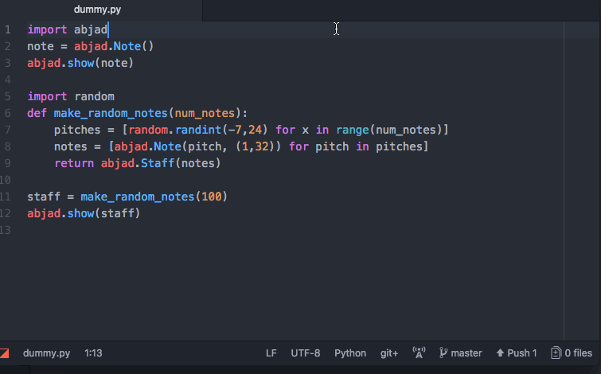

# abjadcompile
abjadcompile is an Atom package and [Hydrogen plugin](https://nteract.gitbooks.io/hydrogen/docs/PluginAPI.html), created and maintained by the [nCoda](www.ncodamusic.org) team, that enables [Abjad](http://abjad.mbrsi.org/) to render .pdf files to an [Atom](https://atom.io/) text editor tab. In tandem with [Hydrogen](https://atom.io/packages/hydrogen)'s line and block execution, abjadcompile enables you to iteratively compose and render scores in a newly flexible and integrated development environment.

## Installation

(1) Download and install [Atom](https://atom.io/) and [LilyPond](http://lilypond.org/download.html).

(2) `pip install abjad` to install [Abjad](http://abjad.mbrsi.org/) into your Python environnment.

(3) `pip install ipython` to install [ipython](https://ipython.org/) into your Python environnment.

(4) Follow the [Atom Flight Manual](https://flight-manual.atom.io/using-atom/sections/atom-packages/)'s instructions to download and install `abjadcompile` from inside Atom (Atom>Preferences>Install>Search for `abjadcompile`, press `install`). Atom should automatically install the package's Node and Atom package dependencies, with your permission.

## Features

### 1. Render an Abjad component as a .pdf score in a new Atom tab.
(1) [Start Hydrogen](https://nteract.gitbooks.io/hydrogen/docs/Usage/GettingStarted.html) in a saved .py file.

(2) Invoke the `abjadcompile: attachMiddleware` command – from [Atom's Command Palette](https://flight-manual.atom.io/getting-started/sections/atom-basics/, keyboard shortcut (`ctrl-alt-m`), contextual (right-click) menu, or "Packages" menu – to insert the Abjad middleware into Hydrogen's kernel communication loop.

(3) Use Hydrogen's execution commands to run any code containing `abjad.show(component)`, where `component` is an illustratable Abjad component, and the object will open as a .pdf in a new Atom tab.

*N.B. - All .pdf files render to a temporary directory but can be saved to disk by clicking the pdf file's path in the lower-left-hand corner of Atom when the pdf's tab is selected.*

## Examples

### A Minimal Example
```
# must be saved as something.py
import abjad
note = abjad.Note()
abjad.show(note)
```

### A Less Minimal Example


### Maximal Examples
[Abjad Score Gallery](http://abjad.mbrsi.org/gallery.html)

## Dependencies
[atom](https://atom.io/)
### Node Package Dependencies (Automatically Installed by Atom)
[atom-package-deps](https://www.npmjs.com/package/atom-package-deps)
### Atom Package Dependencies (Automatically Installed by Atom-Package-Deps)
[hydrogen](https://atom.io/packages/hydrogen)
~
[lilycompile](https://atom.io/packages/lilycompile)
~
[pdf-view](https://atom.io/packages/pdf-view)
### Python Dependencies
[abjad](http://abjad.mbrsi.org/)
~
[ipython](https://ipython.org/)
### External Dependencies
[lilypond](http://lilypond.org/download.html)

## Development
To afford extension and further development, the nCoda team tracks the development of this package via its [feature-architecture matrix](https://docs.google.com/spreadsheets/d/1TLB1WLYEYoO5CJQ_23N-_A9qWLOJJ2n_hy9wHgG-cko/edit?usp=sharing).

## Known Issues
Kernel shutdown/restart currently requires window reload, as the plugin thinks middleware is already attached.

## Props
The team owes a special thank you to [Ben Russert](https://github.com/BenRussert) and [Nikita Kitaev](https://github.com/nikitakit) for their help on this project, and to [Trevor Bača](http://thereddoor.typepad.com/) and [Josiah Wolf Oberholtzer](http://josiahwolfoberholtzer.com/) for Abjad.
